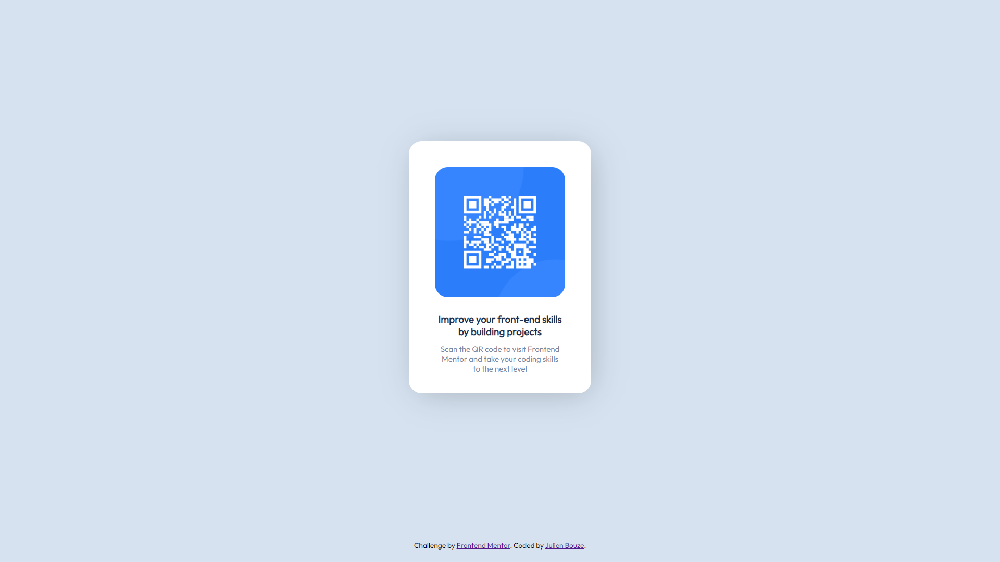

# Frontend Mentor - QR code component solution

This is a solution to the [QR code component challenge on Frontend Mentor](https://www.frontendmentor.io/challenges/qr-code-component-iux_sIO_H). Frontend Mentor challenges help you improve your coding skills by building realistic projects. 

## Table of contents

- [Overview](#overview)
  - [The challenge](#the-challenge)
  - [Screenshot](#screenshot)
  - [Links](#links)
- [My process](#my-process)
  - [Built with](#built-with)
  - [Continued development](#continued-development)
- [Author](#author)

## Overview

### Screenshot

### Links

- Solution URL: https://github.com/julienbouze/Qr
- Live Site URL: https://julienbouze.github.io/Qr/

## My process

### Built with

- Semantic HTML5 markup
- CSS custom properties
- Flexbox
- CSS Grid

### What I learned

I learned the HTML/CSS and flexboxes basics

### Continued development

I want to keep improving my HTML/CSS basics and discover new languages to use with it

## Author

- Github - https://github.com/julienbouze
- Frontend Mentor - https://www.frontendmentor.io/profile/julienbouze